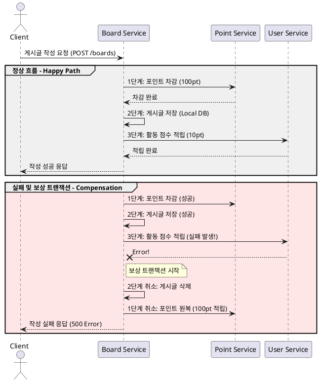

# MSA 실습 프로젝트: 포인트 차감 & 게시글 작성 & 활동 점수 적립

이 프로젝트는 마이크로서비스 아키텍처(MSA) 환경에서 데이터 일관성을 유지하기 위한 **SAGA 패턴(보상 트랜잭션)**을 학습하기 위한 실습용 프로젝트다.

---

## 0. MSA(Microservices Architecture)란?

**MSA**는 하나의 거대한 애플리케이션(Monolith)을 여러 개의 독립적인 서비스로 나누어 개발하고 운영하는 아키텍처 스타일이다.

### 왜 MSA를 사용할까?
- **독립적 배포**: 특정 기능만 수정해서 배포할 수 있다. 전체 시스템을 다시 띄울 필요가 없다.
- **기술 다양성**: 서비스마다 적합한 언어나 DB를 다르게 선택할 수 있다 (예: User는 MySQL, 로그는 MongoDB).
- **확장성(Scalability)**: 트래픽이 몰리는 특정 서비스(예: 주문 서비스)만 서버 대수를 늘릴 수 있어 효율적이다.
- **장애 격리**: 한 서비스가 고장 나도 다른 서비스는 영향을 받지 않고 운영될 수 있다.

### 하지만 MSA에는 커다란 숙제가 있다.
바로 **'데이터 일관성'**이다. 서비스마다 DB가 다르기 때문에, 하나의 비즈니스 로직이 여러 서비스를 건드릴 때 트랜잭션을 하나로 묶을 수 없다(Distributed Transaction 문제). 이를 해결하기 위해 사용하는 대표적인 방법이 **SAGA 패턴**이다.

## 1. 프로젝트 개요

본 프로젝트는 세 개의 독립적인 마이크로서비스로 구성되어 있으며, 각 서비스는 자체 데이터베이스를 가지고 있다.

### 시스템 구조

- **UserService (포트: 8081)**: 사용자 관리 및 활동 점수(Activity Score) 적립 담당.
- **BoardService (포트: 8082)**: 게시글 작성, 조회 및 전체 비즈니스 로직 조율(Saga Orchestrator 역할) 담당.
- **PointService (포트: 8083)**: 사용자 포인트 차감 및 적립 담당.

### 기술 스택
- **Language**: Java 21
- **Framework**: Spring Boot 3.3.x, Spring Data JPA
- **Database**: MySQL 8.0 (서비스별 독립 DB 사용)
- **Container**: Docker, Docker Compose
- **Communication**: RestClient (HTTP/REST)

---

## 2. 비즈니스 로직 흐름

게시글 작성(`POST /boards`) 시 다음과 같은 일련의 프로세스가 진행된다.

1.  **포인트 차감**: `BoardService`가 `PointService`를 호출하여 사용자의 포인트를 100점 차감한다.
2.  **게시글 저장**: 포인트 차감이 성공하면 `BoardService` 자체 DB에 게시글 정보를 저장한다.
3.  **활동 점수 적립**: 게시글 저장이 완료되면 `BoardService`가 `UserService`를 호출하여 작성자에게 활동 점수 10점을 부여한다.

---

## 3. SAGA 패턴 (보상 트랜잭션)

분산 시스템에서는 여러 서비스에 걸친 트랜잭션을 하나로 묶기 어렵다(2PC의 한계). 이를 해결하기 위한 디자인 패턴이 **SAGA 패턴**이다.

### SAGA 패턴의 핵심 아이디어
1.  비즈니스 로직을 여러 개의 **로컬 트랜잭션**으로 나눈다.
2.  각 단계의 트랜잭션이 성공하면 다음 단계로 넘어간다.
3.  만약 중간에 **실패**하면, 이미 성공했던 이전 단계들을 되돌리는 **보상 트랜잭션(Compensating Transaction)**을 실행한다.

### SAGA 패턴의 두 가지 방식
- **Choreography (코레오그래피)**: 중앙 컨트롤러 없이 각 서비스가 이벤트를 주고받으며 알아서 동작하는 방식.
- **Orchestration (오케스트레이션)**: 하나의 중앙 서비스(Orchestrator)가 전체 흐름을 제어하는 방식.

> **본 프로젝트는 `BoardService`가 흐름을 제어하는 'Orchestration' 방식을 단순화하여 구현했다.**

### 적용된 사가 패턴 로직 (`BoardService.java`)

주석과 함께 코드를 살펴보면 각 단계가 어떻게 진행되고, 실패 시 어떻게 복구되는지 명확히 이해할 수 있다.

#### SAGA 시퀀스 다이어그램 (Orchestration)


<details>
<summary>시퀀스 다이어그램 소스 (PlantUML)</summary>



</details>

```java
@Transactional
public void create(CreateBoardRequestDto createBoardRequestDto) {
  // [SAGA 패턴] 서비스 전체의 데이터 일관성을 맞추기 위해 상태 플래그를 관리합니다.
  
  // 게시글 저장을 성공했는 지 판단하는 플래그
  boolean isBoardCreated = false;
  Long savedBoardId = null;

  // 포인트 차감을 성공했는 지 판단하는 플래그
  boolean isPointDeducted = false;

  try {
    // 1단계: 포인트 차감 (외부 서비스 호출)
    // 게시글 작성 전 100 포인트 차감
    pointClient.deductPoints(createBoardRequestDto.getUserId(), 100);
    isPointDeducted = true; // 포인트 차감 성공 플래그 설정

    // 2단계: 게시글 저장 (로컬 트랜잭션)
    Board board = new Board(
        createBoardRequestDto.getTitle(),
        createBoardRequestDto.getContent(),
        createBoardRequestDto.getUserId()
    );

    Board savedBoard = this.boardRepository.save(board);
    savedBoardId = savedBoard.getBoardId();
    isBoardCreated = true; // 게시글 저장 성공 플래그 설정

    // 3단계: 활동 점수 적립 (외부 서비스 호출)
    // 게시글 작성 시 작성자에게 활동 점수 10점 부여
    // 만약 여기서 예외가 발생하면 catch 블록의 보상 트랜잭션이 실행됩니다.
    userClient.addActivityScore(createBoardRequestDto.getUserId(), 10);
    
  } catch (Exception e) {
    // [보상 트랜잭션 (Compensating Transaction)]
    // 이전에 성공했던 작업들을 논리적으로 취소하여 데이터 일관성을 유지합니다.
    
    if (isBoardCreated) {
      // 이미 저장된 게시글이 있다면 삭제 (2단계 취소)
      this.boardRepository.deleteById(savedBoardId);
    }
    if (isPointDeducted) {
      // 이미 차감된 포인트가 있다면 다시 적립 (1단계 취소)
      pointClient.addPoints(createBoardRequestDto.getUserId(), 100);
    }

    // 최종적으로 예외를 다시 던져서 호출자에게 실패를 알립니다.
    throw e;
  }
}
```

- **일관성 보장**: 활동 점수 적립 중에 서버 장애나 예외가 발생하더라도, 이미 차감된 포인트와 저장된 게시글을 원상복구하여 시스템의 전체 데이터 정합성을 유지한다.

---

## 4. 실행 방법

Docker Compose를 사용하여 모든 서비스와 데이터베이스를 한 번에 실행할 수 있다.

```bash
# 전체 서비스 빌드 및 실행
docker-compose up -d --build
```

### 주요 엔드포인트
- **User**: `POST http://localhost:8081/users/sign-up` (회원가입 시 1000포인트 자동 지급)
- **Board**: `POST http://localhost:8082/boards` (게시글 작성 - 포인트 100차감, 활동점수 10점 추가)
- **Point**: `GET http://localhost:8083/points/{userId}` (포인트 잔액 조회)

---

## 5. 핵심 학습 포인트 (Core Concepts)

### 1) Database per Service
각 마이크로서비스는 자신만의 전용 데이터베이스를 가진다. 다른 서비스의 DB에 직접 쿼리를 날리는 것은 금기사항이다. 오직 API를 통해서만 데이터를 주고받는다.

### 2) 느슨한 결합 (Loose Coupling)
서비스들은 서로 내부 구현을 몰라도 된다. 정의된 인터페이스(API)만 맞으면 서로 통신할 수 있으며, 하나를 수정해도 다른 서비스에 미치는 영향이 최소화된다.

### 3) 결과적 일관성 (Eventual Consistency)
실시간으로 모든 DB가 완벽하게 일치하지 않더라도, SAGA 패턴과 같은 메커니즘을 통해 결국에는 데이터가 일관된 상태로 맞춰지는 것을 의미한다.

#### [사례 연구] 데이터가 깨지는(불일치하는) 순간
우리 코드의 `BoardService.create()` 로직을 예로 들어보자.

1.  **포인트는 깎였는데 게시글은 없을 때**: `pointClient.deductPoints()`는 성공했지만, 아직 `boardRepository.save()`가 실행되기 직전인 찰나의 순간. (유저는 돈만 쓰고 글은 안 써진 상태)
2.  **글은 써졌는데 활동 점수는 안 올랐을 때**: 게시글 저장은 성공했지만 `userClient.addActivityScore()`를 호출하기 전. (유저는 글은 썼지만 보상은 못 받은 상태)
3.  **장애 발생 후 복구 중일 때**: `catch` 블록에서 보상 트랜잭션(`addPoints`, `deleteById`)이 실행되는 도중. (일부는 복구되었고 일부는 아직인 상태)

이처럼 MSA에서는 **데이터가 일시적으로 불일치하는 순간이 반드시 존재한다.** 하지만 SAGA 패턴을 통해 최종적으로는 성공하거나, 모두 취소되어 '일관된 상태'로 돌아오게 된다. 이것이 바로 **결과적 일관성**이다.

#### [해결 방법] 결과적 일관성을 관리하는 전략
데이터 불일치 시간을 최소화하고 정합성을 보장하기 위해 다음과 같은 방법들을 사용한다.
- **SAGA 패턴 (보상 트랜잭션)**: 본 프로젝트에 적용된 방식으로, 실패 시 반대 동작을 수행하여 논리적 롤백을 처리한다.
- **재시도(Retry) & 멱등성(Idempotency)**: 일시적인 네트워크 오류라면 성공할 때까지 다시 시도한다. 이때 여러 번 호출해도 결과가 같아야 하는 '멱등성' 확보가 필수다.
- **데드 레터 큐(Dead Letter Queue)**: 여러 번의 재시도 끝에도 실패한 작업은 별도의 저장소(DLQ)에 보관하여 관리자가 수동으로 처리하거나 별도의 복구 로직을 태운다.
- **데이터 보정(Reconciliation)**: 주기적으로 각 서비스의 데이터를 비교하는 배치 프로그램을 돌려, 누락되거나 잘못된 데이터를 찾아내어 수정한다.

> **참고 자료**: [MSA에서 메시징을 활용한 결과적 일관성 유지 (Youtube)](https://www.youtube.com/watch?v=0UiE9YJi_f4) - 결과적 일관성의 개념과 실무적인 해결 방안을 이해하는 데 큰 도움이 된다.

### 4) 보상 트랜잭션 (Compensating Transaction)
데이터베이스의 `ROLLBACK`은 물리적으로 이전 상태로 되돌리지만, 보상 트랜잭션은 **'취소 요청'**이라는 새로운 API를 호출하여 논리적으로 반대되는 행위를 수행하는 것이다 (예: 결제 성공 -> 결제 취소 API 호출).

---
