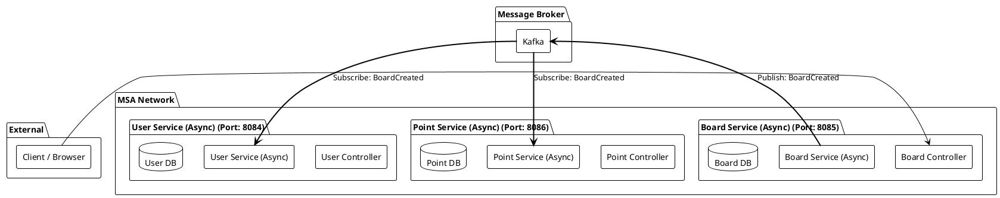

# 🏗️ MSA Kafka Message Queue 실습 프로젝트 (비동기 방식)
> **Kafka를 활용한 메시지 기반 비동기 통신 및 이벤트 기반 아키텍처(EDA)**

이 프로젝트는 마이크로서비스 아키텍처(MSA) 환경에서 **Kafka**를 메시지 브로커로 사용하여 서비스 간 **비동기(Asynchronous) 통신**을 구현하고, 데이터 일관성을 유지하기 위한 **이벤트 기반 SAGA 패턴**을 학습하기 위한 실습용 프로젝트다.

---

## 🚀 0. 비동기 MSA와 Kafka
비동기 통신 방식은 서비스 간의 직접적인 의존성을 줄이고, 시스템의 전체적인 응답성과 가용성을 높이는 데 중요한 역할을 한다.

### 💡 Kafka를 사용하는 이유
- ✅ **느슨한 결합(Loose Coupling)**: 서비스들이 서로의 존재를 몰라도 이벤트를 주고받을 수 있다.
- ✅ **높은 처리량(Throughput)**: 대량의 이벤트를 빠르게 처리하고 저장할 수 있다.
- ✅ **내결함성(Fault Tolerance)**: 특정 서비스가 다운되어도 메시지는 Kafka에 보관되어 나중에 처리될 수 있다.
- ✅ **확장성**: 컨슈머 그룹을 통해 처리를 수평적으로 확장하기 용이하다.

---

## 📋 1. 프로젝트 개요
본 프로젝트는 Kafka를 중심으로 메시지를 발행(Publish)하고 구독(Subscribe)하는 구조로 설계되었다.

### 🏗️ 시스템 아키텍처


### 🛠 Tech Stack
| Category | Technology |
| :--- | :--- |
| **Language** |  |
| **Framework** |   |
| **Message Broker** |  |
| **Database** |  |
| **DevOps** |   |

---

## 🔄 2. 비즈니스 로직 흐름 (Choreography SAGA)
1. **게시글 작성**: `Board Service (Async)`에서 게시글을 DB에 저장하고 `BoardCreated` 이벤트를 Kafka `board-topic`에 발행한다.
2. **포인트 차감**: `Point Service (Async)`가 이벤트를 수신하여 사용자의 포인트를 차감한다.
3. **활동 점수 적립**: `User Service (Async)`가 이벤트를 수신하여 사용자의 활동 점수를 적립한다.

---

## ⚡ 4. 실행 방법

```bash
# Kafka 비동기 서비스 디렉터리로 이동
cd msa-kafka-message-queue-async

# 전체 서비스 빌드 및 실행 (DB + Kafka + Microservices)
docker-compose up -d --build
```

### 🔗 주요 엔드포인트

| Service | Method | URL | Description |
| :--- | :--- | :--- | :--- |
| **User** | `POST` | `http://localhost:8084/users/sign-up` | 회원가입 (1000pt 지급) |
| **Board** | `POST` | `http://localhost:8085/boards` | 게시글 작성 (이벤트 발행 시작) |
| **Point** | `GET` | `http://localhost:8086/points/{userId}` | 포인트 잔액 조회 |

---

## 📚 5. 핵심 학습 포인트 (Core Concepts)
