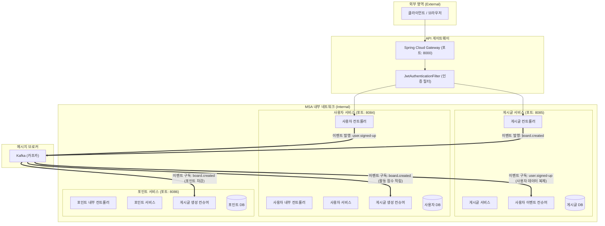
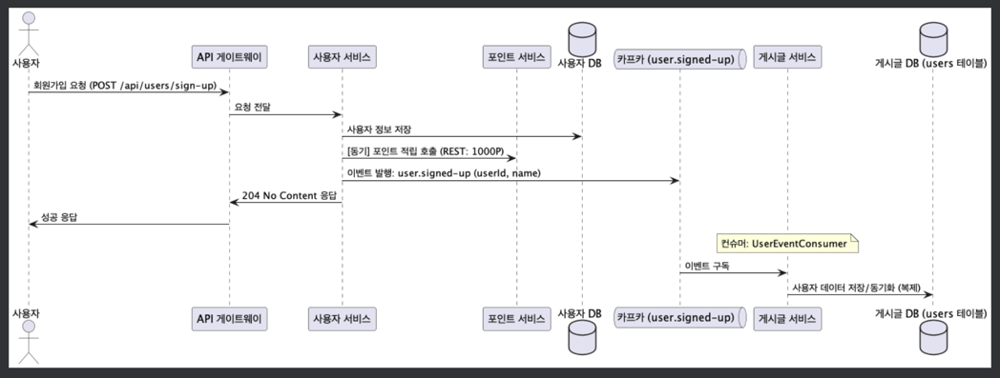
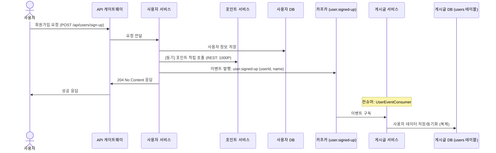
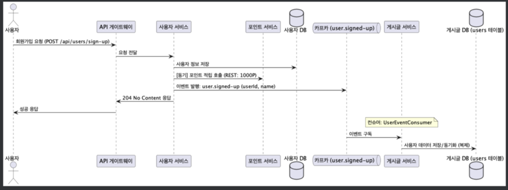
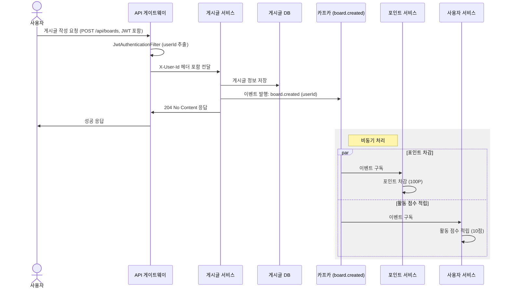
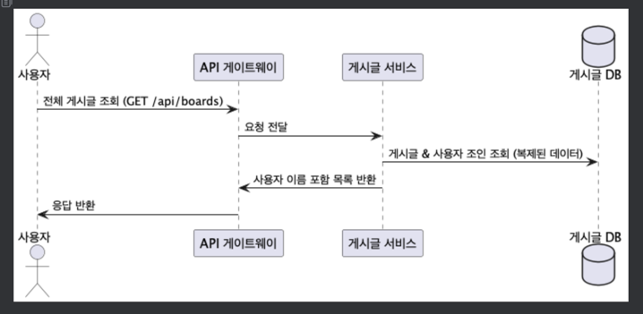
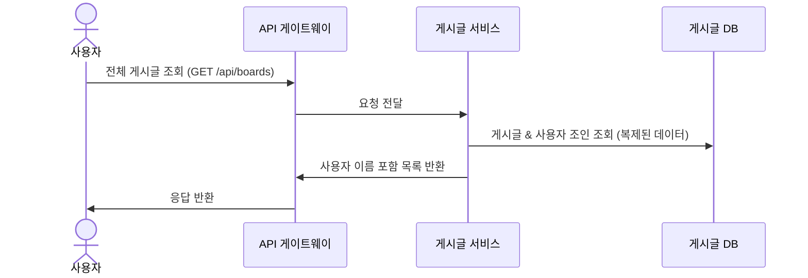

# 🏗️ MSA Kafka Message Queue 실습 프로젝트 (비동기 방식)
> **Kafka를 활용한 메시지 기반 비동기 통신 및 이벤트 기반 아키텍처(EDA)**

이 프로젝트는 마이크로서비스 아키텍처(MSA) 환경에서 **Kafka**를 메시지 브로커로 사용하여 서비스 간 **비동기(Asynchronous) 통신**을 구현하고, 데이터 일관성을 유지하기 위한 **이벤트 기반 SAGA 패턴**을 학습하기 위한 실습용 프로젝트다.

---

## 🚀 0. 비동기 MSA와 Kafka
비동기 통신 방식은 서비스 간의 직접적인 의존성을 줄이고, 시스템의 전체적인 응답성과 가용성을 높이는 데 중요한 역할을 한다.

### 💡 Kafka를 사용하는 이유
- ✅ **느슨한 결합(Loose Coupling)**: 서비스들이 서로의 존재를 몰라도 이벤트를 주고받을 수 있다.
- ✅ **높은 처리량(Throughput)**: 대량의 이벤트를 빠르게 처리하고 저장할 수 있다.
- ✅ **내결함성(Fault Tolerance)**: 특정 서비스가 다운되어도 메시지는 Kafka에 보관되어 나중에 처리될 수 있다.
- ✅ **확장성**: 컨슈머 그룹을 통해 처리를 수평적으로 확장하기 용이하다.

---

## 📋 1. 프로젝트 개요
본 프로젝트는 Kafka를 중심으로 메시지를 발행(Publish)하고 구독(Subscribe)하는 구조로 설계되었다.

### 🏗️ 시스템 아키텍처
<details>
<summary>아키텍처 다이어그램 보기</summary>


</details>

### 🛠 Tech Stack
| Category | Technology |
| :--- | :--- |
| **Language** |  |
| **Framework** |   |
| **Message Broker** |  |
| **Database** |  |
| **DevOps** |   |

---

## 🔄 2. 비즈니스 로직 흐름 (Choreography SAGA)

### 1) 회원가입 및 데이터 복제 (User Signup & Data Replication)
사용자가 회원가입을 하면 `User Service`는 이를 처리하고 이벤트를 발행하며, `Board Service`는 이를 구독하여 데이터를 복제한다.



<details>
<summary>시퀀스 다이어그램 보기</summary>


</details>

### 2) 게시글 작성 및 비동기 처리 (Board Creation & Async Processing)
게시글을 작성하면 `Board Service`는 최소한의 작업(DB 저장) 후 이벤트를 발행하고, 나머지 작업(포인트 차감, 활동 점수 적립)은 타 서비스에서 비동기로 처리한다.



<details>
<summary>시퀀스 다이어그램 보기</summary>


</details>

### 3) 게시글 조회 (Query with Replicated Data)
게시글 조회 시 타 서비스 호출 없이 로컬에 복제된 데이터를 사용하여 성능을 최적화한다.



<details>
<summary>시퀀스 다이어그램 보기</summary>


</details>

---

## ⚡ 4. 실행 방법

```bash
# Kafka 비동기 서비스 디렉터리로 이동
cd msa-kafka-message-queue-async

# 전체 서비스 빌드 및 실행 (DB + Kafka + Microservices)
docker-compose up -d --build
```

### 🔗 주요 엔드포인트

| Service | Method | URL | Description |
| :--- | :--- | :--- | :--- |
| **Gateway** | `-` | `http://localhost:8000` | 모든 서비스의 단일 진입점 |
| **User** | `POST` | `http://localhost:8000/api/users/login` | [외부] 로그인 (JWT 발급) |
| **User** | `POST` | `http://localhost:8000/api/users/sign-up` | [외부] 회원가입 |
| **User** | `GET` | `http://localhost:8084/internal/users/{userId}` | [내부] 특정 사용자 정보 조회 |
| **User** | `GET` | `http://localhost:8084/internal/users` | [내부] 여러 사용자 정보 조회 |
| **User** | `POST` | `http://localhost:8084/internal/users/activity-score/add` | [내부] 활동 점수 적립 |
| **Board** | `POST` | `http://localhost:8000/api/boards` | [외부] 게시글 작성 |
| **Board** | `GET` | `http://localhost:8000/api/boards` | [외부] 전체 게시글 조회 |
| **Board** | `GET` | `http://localhost:8000/api/boards/{boardId}` | [외부] 특정 게시글 조회 |
| **Point** | `GET` | `http://localhost:8086/internal/points/{userId}` | [내부] 포인트 조회 |
| **Point** | `POST` | `http://localhost:8086/internal/points/add` | [내부] 포인트 적립 |
| **Point** | `POST` | `http://localhost:8086/internal/points/deduct` | [내부] 포인트 차감 |

> **Note**: 내부용 API(`/internal/**`)는 API Gateway를 통해 노출되지 않으며, 마이크로서비스 간 직접 통신에만 사용됩니다.

---

## 🧪 API 테스트 결과
상세한 테스트 시나리오와 결과는 [api-test-results.md](./api-test-results.md) 파일에서 확인할 수 있습니다.

---

## 📚 5. 핵심 학습 포인트 (Core Concepts)

### 1) 데이터 동기화 (Data Synchronization)를 통한 조회 최적화
동기 방식(Sync)에서는 게시글을 조회할 때마다 사용자 서비스의 API를 호출하여 정보를 가져왔다. 하지만 비동기 메시징을 활용하면 이를 더 효율적으로 개선할 수 있다.

*   **[개선 방식] 데이터 복제 (Data Replication)**:
    1.  사용자 서비스에서 회원가입/정보수정 시 Kafka로 이벤트를 발행한다 (`user.signed-up`).
    2.  게시글 서비스는 이 이벤트를 구독하여, 필요한 사용자 정보(`userId`, `name`)를 **자신의 로컬 DB에 별도의 테이블로 동기화**한다.
    3.  게시글 조회 시 외부 API 호출 없이 **자신의 DB에서 즉시 조인(Join)**하여 결과를 반환한다.
*   **장점**:
    *   **성능 최적화**: 외부 서비스 API 호출(네트워크 비용)이 사라져 응답 속도가 매우 빠르다.
    *   **부담 경감**: 사용자 서비스의 DB에 부하를 주지 않는다.
    *   **가용성 향상**: 사용자 서비스가 일시적으로 다운되어도 게시글 서비스는 정상적으로 정보를 조회할 수 있다.

### 2) 서비스 간 결합도 해소 (Loose Coupling)
기존 동기 방식에서는 `Board Service`가 `Point Service`와 `User Service`의 API를 직접 호출해야 했다. 이는 한 서비스의 장애가 다른 서비스로 전파되는 '계단식 장애(Cascading Failure)'의 원인이 된다.

*   **[개선 방식] 이벤트 기반 통신**:
    *   `Board Service`는 단순히 "게시글이 생성됨"이라는 사실(Event)만 알린다.
    *   이를 누가 가져다 쓸지는 `Board Service`의 관심사가 아니다.
    *   덕분에 새로운 기능(예: 게시글 작성 시 알림 발송)이 추가되어도 `Board Service`의 코드는 수정할 필요가 없다.

### 4) 결과적 일관성 (Eventual Consistency)
사용자 서비스에서 데이터가 변경된 직후, 게시글 서비스의 DB에 반영되기 전까지 아주 짧은 시간 동안 데이터가 일치하지 않을 수 있다. 하지만 Kafka를 통해 결국에는 데이터가 동기화되어 일관된 상태가 된다.

---

## 🚪 6. API Gateway 도입 완료
현재 시스템은 클라이언트가 각 서비스의 주소(Port)를 직접 알고 호출해야 하는 구조에서 **Spring Cloud Gateway**를 도입하여 개선되었습니다.

### ✅ API Gateway란?
클라이언트(웹, 모바일 등)가 백엔드 API 서버에 접근하기 전에 거쳐가는 **단일 진입점(Entry Point)** 역할을 하는 서버다.

### ✅ 도입 이유
1.  **라우팅 (Routing)**: 클라이언트가 여러 서비스의 주소를 일일이 알 필요 없이 Gateway 주소 하나로 모든 요청이 가능하다.
    *   `localhost:8084` (User), `8085` (Board), `8086` (Point) → **`localhost:8000` (Gateway)**
2.  **공통 로직 처리 (Cross-cutting Concerns)**: 인증(JWT), 로깅, 필터링 등 여러 서비스에서 공통으로 필요한 로직을 한 곳에서 처리하여 코드 중복을 제거한다.

### ✅ 인증 처리 방식 (JWT)
본 프로젝트에서는 **Centralized Authentication** 방식을 채택하여 API Gateway에서 모든 외부 요청에 대한 인증을 처리합니다.

1.  **로그인**: `User Service`에서 사용자 정보를 확인하고 JWT 토큰을 발급합니다.
2.  **인증 필터**: `API Gateway`의 `JwtAuthenticationFilter`가 모든 `/api/**` 요청(로그인/회원가입 제외)에 대해 헤더의 JWT 토큰을 검증합니다.
3.  **내부 통신**: 마이크로서비스 간의 내부 통신(`/internal/**`)은 신뢰할 수 있는 네트워크 내에 있다고 가정하여 별도의 인증 로직을 적용하지 않습니다.

### ✅ 활용 도구
*   **Spring Cloud Gateway**: 스프링 생태계에서 제공하는 프레임워크 기반 API Gateway로, 직접 커스텀 로직을 구현하기 용이하다.
