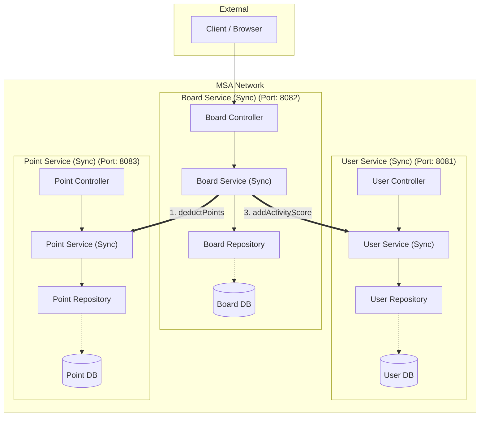
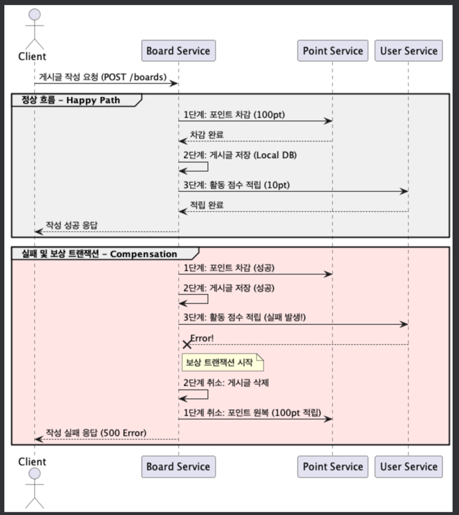
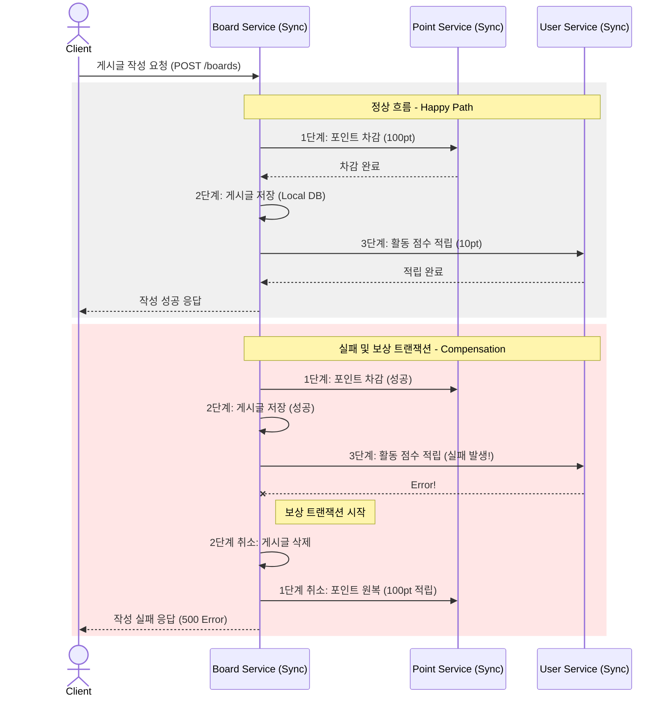

# 🏗️ MSA SAGA Pattern 실습 프로젝트 (동기 방식)
> **포인트 차감 & 게시글 작성 & 활동 점수 적립**

이 프로젝트는 마이크로서비스 아키텍처(MSA) 환경에서 **동기(Synchronous) 통신**을 기반으로 데이터 일관성을 유지하기 위한 **SAGA 패턴(보상 트랜잭션)**을 학습하기 위한 실습용 프로젝트다.

---

## 🚀 0. MSA(Microservices Architecture)란?

**MSA**는 하나의 거대한 애플리케이션(Monolith)을 여러 개의 독립적인 서비스로 나누어 개발하고 운영하는 아키텍처 스타일이다.

### 💡 왜 MSA를 사용할까?
- ✅ **독립적 배포**: 특정 기능만 수정해서 배포할 수 있다.
- ✅ **기술 다양성**: 서비스마다 적합한 언어나 DB를 선택할 수 있다.
- ✅ **확장성(Scalability)**: 필요한 서비스만 개별적으로 확장 가능하다.
- ✅ **장애 격리**: 한 서비스의 장애가 전체로 확산되는 것을 방지한다.

> ⚠️ **MSA의 과제: '데이터 일관성'**
> 서비스마다 DB가 격리되어 있어 기존의 단일 트랜잭션 처리가 불가능하다. 이를 해결하기 위해 **SAGA 패턴**을 사용한다.

---

## 📋 1. 프로젝트 개요

본 프로젝트는 세 개의 독립적인 마이크로서비스로 구성되어 있다.

### 🏗️ 시스템 아키텍처



### 🛠 Tech Stack

| Category | Technology |
| :--- | :--- |
| **Language** |  |
| **Framework** |   |
| **Database** |  |
| **DevOps** |   |
| **Communication** |  |

---

## 🔄 2. 비즈니스 로직 흐름

게시글 작성(`POST /boards`) 시 다음 프로세스가 순차적으로 진행된다.

1.  **포인트 차감**: `BoardService` → `PointService` (100pt 차감)
2.  **게시글 저장**: `BoardService` Local DB에 저장
3.  **활동 점수 적립**: `BoardService` → `UserService` (10pt 적립)

---

## 🛡️ 3. SAGA 패턴 (보상 트랜잭션)

중앙 서비스(Orchestrator)가 전체 흐름을 제어하는 **Orchestration** 방식을 사용한다.

### 📝 적용된 로직 (`BoardService.java`)

#### SAGA 시퀀스 다이어그램


<details>
<summary>🔍 시퀀스 다이어그램 소스 보기</summary>



</details>

#### 💻 핵심 코드 snippet (BoardService.java)

```java
@Transactional
public void create(CreateBoardRequestDto createBoardRequestDto) {
  // [SAGA 패턴] 서비스 전체의 데이터 일관성을 맞추기 위해 상태 플래그를 관리한다.
  boolean isBoardCreated = false;
  Long savedBoardId = null;
  boolean isPointDeducted = false;

  try {
    // 1단계: 포인트 차감 (외부 서비스 호출)
    pointClient.deductPoints(createBoardRequestDto.getUserId(), 100);
    isPointDeducted = true;

    // 2단계: 게시글 저장 (로컬 트랜잭션)
    Board board = new Board(createBoardRequestDto.getTitle(), createBoardRequestDto.getContent(), createBoardRequestDto.getUserId());
    Board savedBoard = this.boardRepository.save(board);
    savedBoardId = savedBoard.getBoardId();
    isBoardCreated = true;

    // 3단계: 활동 점수 적립 (외부 서비스 호출)
    userClient.addActivityScore(createBoardRequestDto.getUserId(), 10);
    
  } catch (Exception e) {
    // [보상 트랜잭션 (Compensating Transaction)]
    if (isBoardCreated) this.boardRepository.deleteById(savedBoardId);
    if (isPointDeducted) pointClient.addPoints(createBoardRequestDto.getUserId(), 100);
    throw e;
  }
}
```

---

## ⚡ 4. 실행 방법

```bash
# REST API 서비스 디렉토리로 이동
cd msa-rest-api-sync

# 전체 서비스 빌드 및 실행
docker-compose up -d --build
```

### 🔗 주요 엔드포인트

| Service | Method | URL | Description |
| :--- | :--- | :--- | :--- |
| **User** | `POST` | `http://localhost:8081/users/sign-up` | 회원가입 (1000pt 지급) |
| **Board** | `POST` | `http://localhost:8082/boards` | 게시글 작성 (SAGA 시작) |
| **Point** | `GET` | `http://localhost:8083/points/{userId}` | 포인트 잔액 조회 |

---

## 📚 5. 핵심 학습 포인트 (Core Concepts)

### 1) Database per Service
각 마이크로서비스는 자신만의 전용 데이터베이스를 가진다. 다른 서비스의 DB에 직접 쿼리를 날리는 것은 금기사항이다. 오직 API를 통해서만 데이터를 주고받는다.

*   **[사례] 게시글 조회 시 사용자 정보 포함**:
    *   게시글 서비스(`Board Service`)가 게시글 정보를 조회할 때, 작성자의 이름(`name`)이 필요하다.
    *   하지만 게시글 DB에는 `user_id`만 있고 `name`은 없다.
    *   이를 해결하기 위해 `Board Service`는 **사용자 서비스(`User Service`)의 API를 호출**하여 실시간으로 사용자 정보를 가져온다.
    *   이 방식은 구현이 직관적이지만, 조회 트래픽이 몰릴 경우 `User Service`의 DB에 큰 부담을 줄 수 있다는 단점이 있다.

### 2) 느슨한 결합 (Loose Coupling)
서비스들은 서로 내부 구현을 몰라도 된다. 정의된 인터페이스(API)만 맞으면 서로 통신할 수 있으며, 하나를 수정해도 다른 서비스에 미치는 영향이 최소화된다.

### 3) 결과적 일관성 (Eventual Consistency)
실시간으로 모든 DB가 완벽하게 일치하지 않더라도, SAGA 패턴과 같은 메커니즘을 통해 결국에는 데이터가 일관된 상태로 맞춰지는 것을 의미한다.

#### [사례 연구] 데이터가 깨지는(불일치하는) 순간
우리 코드의 `BoardService.create()` 로직을 예로 들어보자.

*   **포인트는 깎였는데 게시글은 없을 때**: `pointClient.deductPoints()`는 성공했지만, 아직 `boardRepository.save()`가 실행되기 직전인 찰나의 순간. (유저는 돈만 쓰고 글은 안 써진 상태)
*   **글은 써졌는데 활동 점수는 안 올랐을 때**: 게시글 저장은 성공했지만 `userClient.addActivityScore()`를 호출하기 전. (유저는 글은 썼지만 보상은 못 받은 상태)
*   **장애 발생 후 복구 중일 때**: `catch` 블록에서 보상 트랜잭션(`addPoints`, `deleteById`)이 실행되는 도중. (일부는 복구되었고 일부는 아직인 상태)

이처럼 MSA에서는 데이터가 일시적으로 불일치하는 순간이 반드시 존재한다. 하지만 SAGA 패턴을 통해 최종적으로는 성공하거나, 모두 취소되어 '일관된 상태'로 돌아오게 된다. 이것이 바로 결과적 일관성이다.

#### [해결 방법] 결과적 일관성을 관리하는 전략
데이터 불일치 시간을 최소화하고 정합성을 보장하기 위해 다음과 같은 방법들을 사용한다.

*   **SAGA 패턴 (보상 트랜잭션)**: 본 프로젝트에 적용된 방식으로, 실패 시 반대 동작을 수행하여 논리적 롤백을 처리한다.
*   **재시도(Retry) & 멱등성(Idempotency)**: 일시적인 네트워크 오류라면 성공할 때까지 다시 시도한다. 이때 여러 번 호출해도 결과가 같아야 하는 '멱등성' 확보가 필수다.
*   **데드 레터 큐(Dead Letter Queue)**: 여러 번의 재시도 끝에도 실패한 작업은 별도의 저장소(DLQ)에 보관하여 관리자가 수동으로 처리하거나 별도의 복구 로직을 태운다.
*   **데이터 보정(Reconciliation)**: 주기적으로 각 서비스의 데이터를 비교하는 배치 프로그램을 돌려, 누락되거나 잘못된 데이터를 찾아내어 수정한다.

> **참고 자료**: [MSA에서 메시징을 활용한 결과적 일관성 유지 (Youtube)](https://www.youtube.com/watch?v=0UiE9YJi_f4) - 결과적 일관성의 개념과 실무적인 해결 방안을 이해하는 데 큰 도움이 된다.

### 4) 보상 트랜잭션 (Compensating Transaction)
데이터베이스의 ROLLBACK은 물리적으로 이전 상태로 되돌리지만, 보상 트랜잭션은 **'취소 요청'**이라는 새로운 API를 호출하여 논리적으로 반대되는 행위를 수행하는 것이다 (예: 결제 성공 -> 결제 취소 API 호출).
